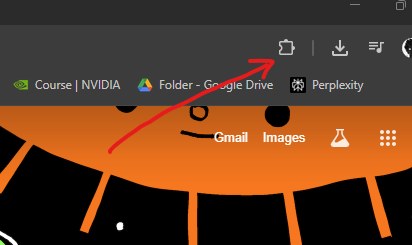
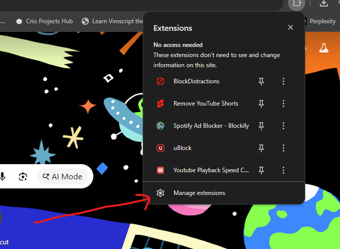
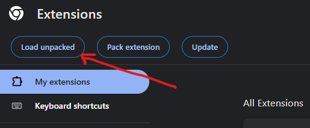
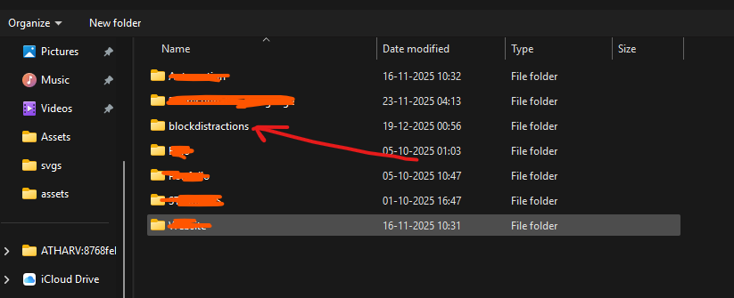
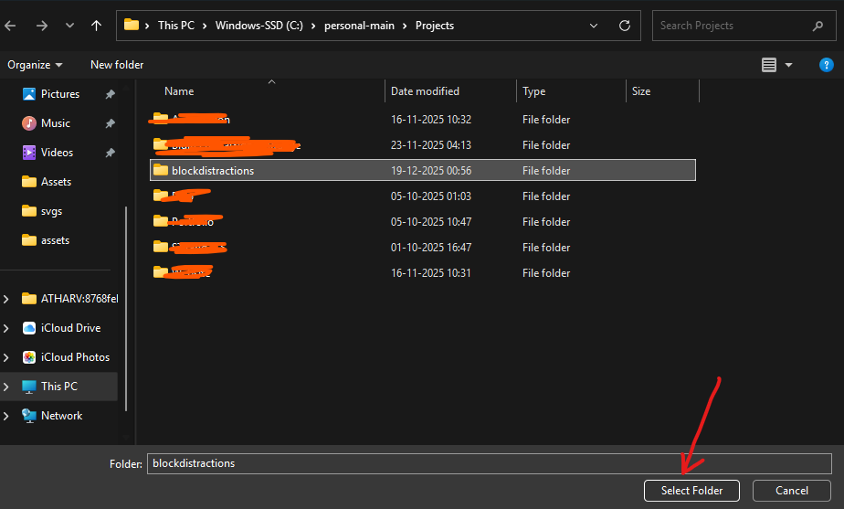
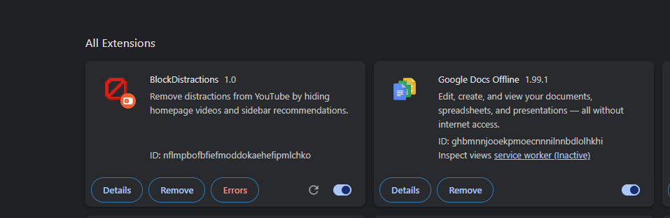

# BlockDistractions

BlockDistractions is a Chrome extension designed to help you focus by removing distractions from YouTube. It hides the homepage video feed and sidebar recommendations, allowing you to search for what you need without getting sucked into the rabbit hole.

## Features

- **Hide Homepage Feed**: Removes the grid of recommended videos on the YouTube homepage.
- **Hide Sidebar Recommendations**: Hides the "Up Next" and recommended videos sidebar on the watch page.
- **Theater Mode**: Automatically attempts to enable theater mode when blocking is active.
- **Toggle On/Off**: Easily enable or disable the blocking features from the extension popup.

## Installation

1.  **Clone the repository**:
    ```bash
    git clone https://github.com/atharvsalvi/blockdistractions.git
    ```

2.  **Load the extension in Chrome**:

    ### Step 1
    
    Click on the extensions icon in your browser toolbar.

    ### Step 2
    
    Click on 'Manage extensions'.

    ### Step 3
    
    Click the 'Load unpacked' button in the top left corner. (Ensure 'Developer mode' is enabled).

    ### Step 4
    
    Navigate to the directory where you cloned the repository.

    ### Step 5
    
    Click the 'Select Folder' button.

    ### Step 6
    
    The extension should now appear in your browser.

## Usage

1.  Click the **BlockDistractions** icon in your Chrome toolbar (you may need to pin it first).
2.  Use the toggle switch to enable or disable the distraction blocking.
    *   **Distractions Hidden**: Homepage feed and sidebar are hidden.
    *   **Distractions Visible**: YouTube behaves normally.
3.  The changes apply immediately without needing to refresh the page.

## Permissions

- `storage`: Used to save your preference (On/Off state).
- `activeTab` / Host Permissions: Access to `www.youtube.com` to modify the page content.
